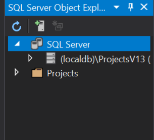
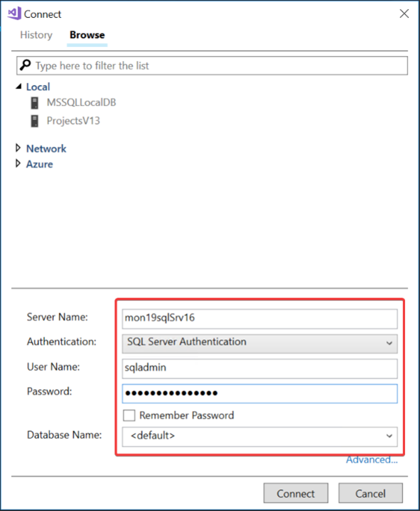
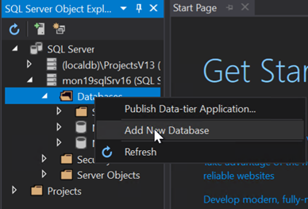
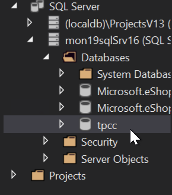
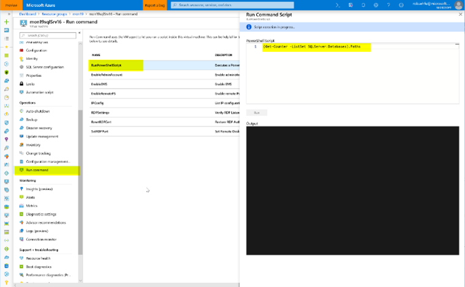
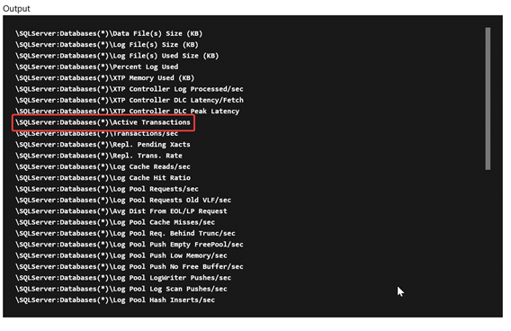
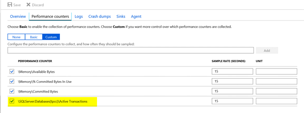
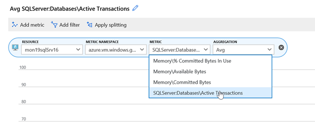
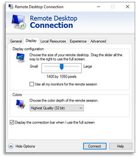
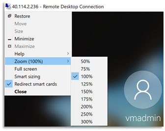

# Challenge 1: Alerts, Activity Logs and Service Health

[Previous Challenge](./00-Getting-Started.md) - **[Home](../README.md)** - [Next Challenge>](./02-Monitoring-Basics-And-Dashboards.md)

## Notes & Guidance

1. Create an empty database called “tpcc” on the SQL Server
Note: Use SQL Auth with the username being sqladmin and password being whatever you used during deployment

    - Connect (RDP) to the Visual Studio Server (xxxxxVSSrv17) using its public IP address and open Visual Studio.  Create an account if you don’t have one.
    - Visual Studio has view called SQL Server Object Explorer that can be used to create and delete SQL databases on the SQL server.
    
    - Connect to the database server VM, make sure to use "sqladmin" and the password you stored in the key vault during deployment.
    
    
    - Once connected create a new database called “tpcc”
    

2. From the ARM template, send the below guest OS metric to Azure Monitor for the SQL Server

    - Add a Performance Counter Metric for:
        - Object: SQLServer:Databases
        - Counter: Active Transactions
        - Instance:tpcc

    - [Hint](https://docs.microsoft.com/en-us/azure/monitoring-and-diagnostics/metrics-store-custom-guestos-resource-manager-vm)
    - First, figure out the correct format for the counter use the run command on the SQL Server in the Azure portal and run:
    `(Get-Counter -ListSet SQLServer:Databases).Paths`
    

3. Once its finished, review the results (scroll up) and copy the output for the SQLServer:Databases counter: \SQLServer:Databases(*)\Active Transactions

4. Change it to target just your specific database: \SQLServer:Databases(tpcc)\Active Transactions.
5. Once you have the counter you need to modify the ARM template for the SQL Server to add the collection of this counter that sends it to Azure Monitor using the Azure monitor data sink.  Add the following JSON to the SQL Server code:

    - Verify the identity is present in the template and add if missing:
    ```json
    "identity": {
        "type": "SystemAssigned"
    },

    ```
    - Add the missing counter:
    ```json
    "resources":[
        {
            "type": "extensions",
            "name": "Microsoft.Insights.VMDiagnosticsSettings",
            "apiVersion": "2015-05-01-preview",
            "location": "[resourceGroup().location]",
            "dependsOn": [
                "[concat('Microsoft.Compute/virtualMachines/', concat(parameters('envPrefixName'), 'sqlSrv16'))]"
                    ],
            "properties": {
                "publisher": "Microsoft.Azure.Diagnostics",
                "type": "IaaSDiagnostics",
                "typeHandlerVersion": "1.5",
                "autoUpgradeMinorVersion": true,
                "settings": {
                    "WadCfg": {
                        "DiagnosticMonitorConfiguration": {
                            "overallQuotaInMB": 4096,
                            "DiagnosticInfrastructureLogs": {
                                "scheduledTransferLogLevelFilter": "Error"
                            },
                            "Directories": {
                                "scheduledTransferPeriod": "PT1M",
                                "IISLogs": {
                                    "containerName": "wad-iis-logfiles"
                                },
                                "FailedRequestLogs": {
                                    "containerName": "wad-failedrequestlogs"
                                }
                            },
                            "PerformanceCounters": {
                                "scheduledTransferPeriod": "PT1M",
                                "sinks": "AzMonSink",
                                "PerformanceCounterConfiguration": [
                                    {
                                        "counterSpecifier": "\\Memory\\Available Bytes",
                                        "sampleRate": "PT15S"
                                    },
                                    {
                                        "counterSpecifier": "\\Memory\\% Committed Bytes In Use",
                                        "sampleRate": "PT15S"
                                    },
                                    {
                                        "counterSpecifier": "\\Memory\\Committed Bytes",
                                        "sampleRate": "PT15S"
                                    },
                                    {
                                        "counterSpecifier": "\\SQLServer:Databases(tpcc)\\Active Transactions",
                                        "sampleRate": "PT15S"
                                    }
                                ]
                            },
                            "WindowsEventLog": {
                                "scheduledTransferPeriod": "PT1M",
                                "DataSource": [
                                    {
                                        "name": "Application!*"
                                    }
                                ]
                            },
                            "Logs": {
                                "scheduledTransferPeriod": "PT1M",
                                "scheduledTransferLogLevelFilter": "Error"
                            }
                        },
                        "SinksConfig": {
                            "Sink": [
                                {
                                    "name": "AzMonSink",
                                    "AzureMonitor": {}
                                }
                            ]
                        }
                    },
                    "StorageAccount": "[variables('storageAccountName')]"
                },
                "protectedSettings": {
                    "storageAccountName": "[variables('storageAccountName')]",
                    "storageAccountKey": "[listKeys(variables('accountid'),'2015-06-15').key1]",
                    "storageAccountEndPoint": "https://core.windows.net/"
                }
            }
        },
        {
            "type": "extensions",
            "name": "WADExtensionSetup",
            "apiVersion": "2015-05-01-preview",
            "location": "[resourceGroup().location]",
            "dependsOn": [
                "[concat('Microsoft.Compute/virtualMachines/', concat(parameters('envPrefixName'), 'sqlSrv16'))]"
            ],
            "properties": {
                "publisher": "Microsoft.ManagedIdentity",
                "type": "ManagedIdentityExtensionForWindows",
                "typeHandlerVersion": "1.0",
                "autoUpgradeMinorVersion": true,
                "settings": {
                    "port": 50342
                }
            }
        }
    ]
    ```
6. Save the ARM template and redeploy.
7. Once redeployed, go to metrics and check to make sure you are seeing the new metrics.



> **TIP**: A bunch of OS metrics are configured already under the scale set as a sample.
8. Download and install the [HammerDB tool](http://www.hammerdb.com/) on the Visual Studio VM.
> **Note**: HammerDB does not have native support for Windows Display Scaling. This may result in a smaller than usual UI that is difficult to read over high resolution RDP sessions. If you run into this issue later, close and re-open your RDP session to the VSServer with a lower display resolution. After the RDP session connects, you can zoom into to adjust the size.




## Learning Resources

- [How to find the database counter](https://docs.microsoft.com/en-us/powershell/module/microsoft.powershell.diagnostics/get-counter?view=powershell-5.1)
