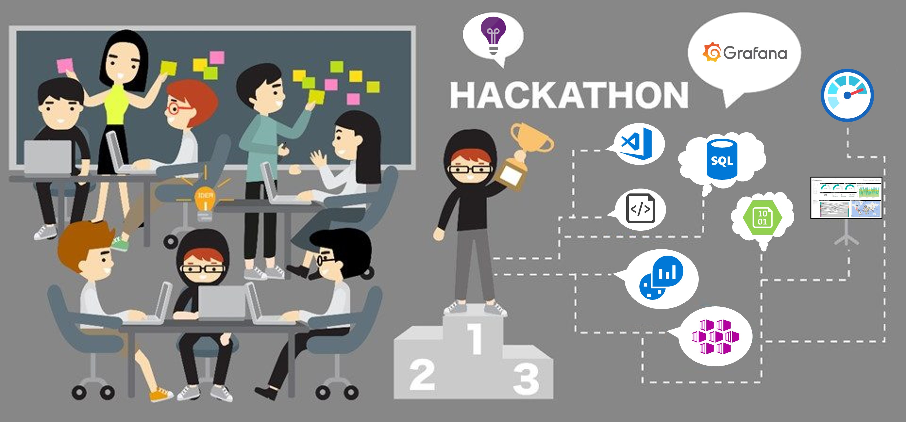
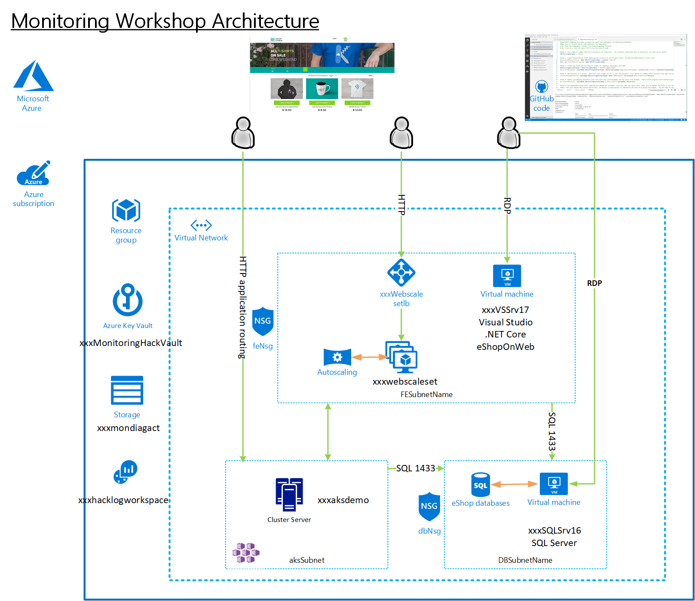

# Azure Monitoring

## Introduction

The Azure Monitoring V2 What-the-Hack provides hands on experience on how to monitor Azure workloads using Azure Monitor, Log Analytics, Insights and Grafana. This hack was designed specifically for DevOps engineers, administrators and IT architects who want to build their knowledge on Azure Monitor. However, anyone with a passion around Monitoring is welcome!  

 

## Learning Objectives

Understand Azure Monitor capabilities, facilitate an Azure Monitor customer conversation, and demo key features of Azure Monitor.

## Challenges

- Challenge 0: **[Getting Started](Student/00-Getting-Started.md)**
- Challenge 1: **[Alerts, Activity Logs and Service Health](Student/01-Alerts-Activity-Logs-And-Service-Health.md)**
- Challenge 2: **[Monitoring Basics and Dashboards](Student/02-Monitoring-Basics-And-Dashboards.md)**
- Challenge 3: **[Azure Monitor for Virtual Machines](Student/03-Azure-Monitor-For-Virtual-Machines.md)**
- Challenge 4: **[Azure Monitor for Applications](Student/04-Azure-Monitor-For-Applications.md)**
- Challenge 5: **[Azure Monitor for Containers](Student/05-Azure-Monitor-For-Containers.md)**
- Challenge 6: **[Log Queries with KQL and Grafana](Student/06-Log-Queries-With-KQL-And-Grafana.md)**
- Challenge 7: **[Visualizations](Student/07-Visualizations.md)**

## Prerequisites

1. Please review the following docs before or during the event when necessary
    - [Send Guest OS metrics to the Azure Monitor metric store](https://docs.microsoft.com/en-us/azure/azure-monitor/platform/collect-custom-metrics-guestos-resource-manager-vm)

    - [Get Started with Metrics Explorer](https://docs.microsoft.com/en-us/azure/azure-monitor/platform/metrics-getting-started)

    - [View and Manage Alerts in Azure Portal](https://docs.microsoft.com/en-us/azure/azure-monitor/platform/alerts-metric#view-and-manage-with-azure-portal)

    - [Create metric alerts with ARM templates](https://docs.microsoft.com/en-us/azure/azure-monitor/platform/alerts-metric-create-templates)

    - [Create Action Rules](https://docs.microsoft.com/en-us/azure/azure-monitor/platform/alerts-action-rules)

    - [Monitor your Kubernetes Cluster](https://docs.microsoft.com/en-us/azure/azure-monitor/insights/container-insights-analyze)

    - [View Kubernetes logs, events, and pod metrics in real-time](https://docs.microsoft.com/en-us/azure/azure-monitor/insights/container-insights-livedata-overview)

    - [Start Monitoring Your ASP.NET Core Web Application](https://docs.microsoft.com/en-us/azure/azure-monitor/learn/dotnetcore-quick-start)

    - [What does Application Insights Monitor](https://docs.microsoft.com/en-us/azure/azure-monitor/app/app-insights-overview#what-does-application-insights-monitor)

    - [Grafana Integration](https://grafana.com/grafana/plugins/grafana-azure-monitor-datasource)

    - [Create interactive reports with workbooks](https://docs.microsoft.com/en-us/azure/azure-monitor/app/usage-workbooks)

2. Attendees have access to an Azure Subscription where they can each deploy the provided ARM template that will build a very detailed infrastructure to monitor.  This includes the Vnet, subnets, NSG(s), LB(s), NAT rules, scales set and a fully functional .NET Core Application (eShopOnWeb) to monitor.
3. Attendees should have a level 200-300 understanding of the Azure platform.  Understand concepts like PowerShell, Azure Cli, ARM, resource groups, RBAC, network, storage, compute, scale sets, virtual machines and security.  Previous experience working with ARM templates is recommended.
4. Access to a machine with Visual Studio Code and the Azure PowerShell Modules loaded or Azure CLI. VS Code ARM and PowerShell extensions should be configured.

